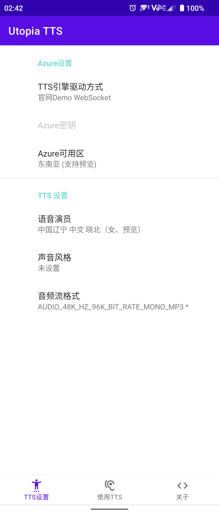

# Utopia TTS (WIP)
This is an Android TTS engine based on Microsoft TTS with personal token.  
这是一个基于微软TTS的安卓文字转语音引擎，使用个人Token。
正在开发中  

### 使用教程
暂无

### 鸣谢
大佬[ag2s20150909](https://github.com/ag2s20150909)的[TTS](https://github.com/ag2s20150909/TTS)项目

### 演示  
#### 应用截图
  

#### 演示视频
视频见[使用演示：medias/ScreenRecord.mp4](DemoMedia/ScreenRecord.mp4)

### 开发进程
  
20220929：微软仿佛有什么大病，才写了三天，五十万字的额度就耗尽了，这绝对不可能啊。算了，之后再说吧，躺了。至于官网Demo驱动的，还是去用ag2s写的TTS吧，日

20221202：尝试继承了一下ag2s大佬的ws方法，确实能用，等之后优化一下就可以发一版了

20230123：进行了一些简单的优化，发布一个[正式测试版](https://github.com/UtopiaXC/UtopiaTTS/releases/tag/0.0.1-beta03)。建议使用Demo WebSocket模式，同时选择东南亚可用区（这个可用区在我这测是网络问题最小的），需要的在[Release](https://github.com/UtopiaXC/UtopiaTTS/releases/tag/0.0.1-beta03)中自取。